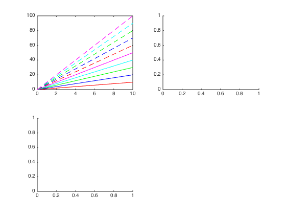
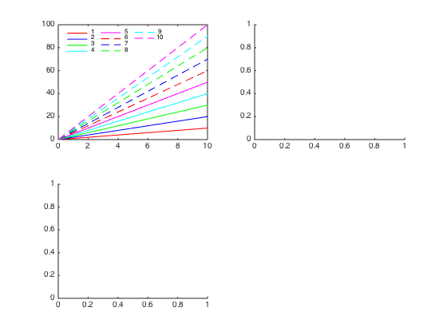
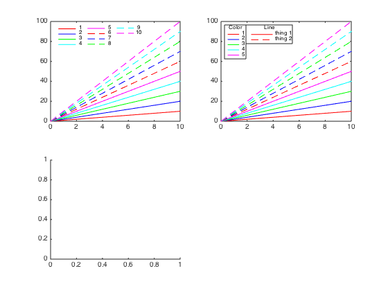
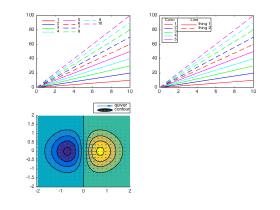

## legendflex.m Documentation

This function offers a more flexible version of the legend command.  It
offers a different method of positioning the legend, as well as options
to:
 
* organize legend text and symbols in a grid with a specified number of
  rows and/or columns 
* rescale the horizontal space used by each legend symbol
* create multiple legends for the same axis
* add a title to the legend within the legend box

### Syntax

```
 legendflex(M, param1, val1, ...)
 legendflex(h, M, param1, val1, ...)
 [legend_h,object_h,plot_h,text_str] = legendflex(...)
```

### Description

Unlike in the default legend command, where the legend is positioned
relative to the labeled objects' parent axis according to one of 16
location strings, this function positions the legend based on two anchor
points (one on either the figure or a child object of a figure, and one
on the legend itself) and a buffer (or offset) between these two anchor
points. The anchor points refer to the corners and centers of each
side of the box surrounding the reference object and the legend itself;
they can be refered to either as numbers (1-8, clockwise from northwest
corner) or strings ('nw', 'n', 'ne', 'e', 'se', 's', 'sw', 'w').  The
position of the legend is determined by these two points and the distance
between them, defined in the 'buffer' variable, which by default is
measured in pixels.  So the combination of

```matlab
 (..., 'ref', gca, 'anchor', [3 3], 'buffer', [-10 -10])
```
means that you want the northeast corner of the current axis to be
aligned with the northeast corner of the legend, but with the legend
shifted 10 pixels to the left and down. 


This method of positioning can be particularly useful when labeling a
figure that includes many subplots that share a common color scheme,
where the "best" location for a legend is not necessarily within the
bounds of an axis.  Unlike the legend command, the axes in the figure are
never resized (and it is up to the user to check that the legend fits on
the figure in the specified location).  In addition to being easier than
manually positioning a legend, this function updates the legend location
when the figure is resized, preserving the desired alignment.  The
following anchor/buffer combinations, when used with the default
reference and a buffer unit of pixels, approximately replicate the
typical legend locations:

```
 Specifier              Anchor    Buffer

 north                  [2 2]     [  0 -10]
 south                  [6 6]     [  0  10]
 east                   [4 4]     [-10   0]
 west                   [8 8]     [ 10   0]
 northeast              [3 3]     [-10 -10]
 northwest              [1 1]     [ 10 -10]
 southeast              [5 5]     [-10  10]
 southwest              [7 7]     [ 10  10]
 northoutside*          [2 6]     [  0  10]
 southoutside*          [6 2]     [  0 -10]
 eastoutside*           [3 8]     [ 10   0]
 westoutside*           [8 3]     [-10   0]
 northeastoutside*      [3 1]     [ 10   0]
 northwestoutside*      [1 3]     [-10   0]
 southeastoutside*      [5 7]     [ 10   0]
 southwestoutside*      [7 5]     [-10   0]  *placed outside axis rather
                                              than resizing plot box
```

This function should support all types of plot objects.

Further customization can be applied via the parameters:

* `nrow`, `ncol`: Arrange entries in a grid rather than a single column
* `box`: add or remove a box outline around the legend
* `xscale`: scale the horizontal space taken up by each marker
* `title`: add a title to the legend, above the list but within the axis
  box

### Example
The following example reproduces the screenshot used for this function.

First, let's create a subplot with 10 lines, 5 solid and 5 dashed, which
cycle through 5 colors:

```matlab
figure('color','w');
for iax = 1:3
    ax(iax) = subplot(2,2,iax);
end

linespec = [repmat({'r';'b';'g';'c';'m'},2,1), ...
            [repmat({'-'}, 5, 1); repmat({'--'}, 5, 1)]];


x = [0 10];
y = (1:10)'*x;
lbl = cellstr(num2str((1:10)'));

hln(:,1) = plot(ax(1), x, y);
set(hln(:,1), {'color','linestyle'}, linespec);
```



Now add a legend in the upper left corner, with the entries arranged in a
4 x 3 grid so they don't interfere with the data.  We've also decreased
the horizontal space used by each legend line:

```matlab
[hl(1).leg, hl(1).obj, hl(1).hout, hl(1).mout] = ...
    legendflex(hln(:,1), lbl, 'anchor', {'nw','nw'}, ...
    'buffer', [5 -5], ...
    'ncol', 3, ...
    'fontsize', 8, ...
    'xscale', 0.8, ...
    'box', 'off');
```               
           
                          
Plot the same lines in the second subplot.  But this time, let's add two
legends: one for color, and one for line style.  Note that in this case,
the second legend is positioned relative to the first, rather than
relative to the axis itself:

```matlab
hln(:,2) = plot(ax(2), x, y);
set(hln(:,2), {'color','linestyle'}, linespec);

[hl(2).leg, hl(2).obj, hl(2).hout, hl(2).mout] = ...
    legendflex(hln(1:5,2), lbl(1:5), ...
    'anchor', {'nw','nw'}, ...
    'buffer', [5 -5], ...
    'fontsize',8, ...
    'xscale',0.5, ...
    'title', 'Color');
[hl(3).leg, hl(3).obj, hl(3).hout, hl(3).mout] = ...
    legendflex(hln([1 6],2), {'thing 1', 'thing 2'}, ...
    'ref', hl(2).leg, ...
    'anchor', {'ne','nw'}, ...
    'buffer', [0 0], ...
    'fontsize', 8', ...
    'title', 'Line');
```


Our final subplot simply shows that this function will handle all graphics object types\*.  We plot a contourf plot overlaid with a quiver plot, and
label both above the subplot axis. 

*_Well, almost any graphics object.  In 2014b, there are some rendering bugs when legend is called with multiple outputs that can cause weird stuff to happen when labeling contour objects; I can't do anything about that until the Mathworks fixes the rendering bug._

```matlab
[X,Y] = meshgrid(-2:.2:2);
Z = X.*exp(-X.^2 - Y.^2);
[DX,DY] = gradient(Z,.2,.2);
axes(ax(3));
hold on;
[c,hcont] = contourf(X,Y,Z);
hquiv = quiver(X,Y,DX,DY);

[hl(4).leg, hl(4).obj, hl(4).hout, hl(4).mout] = ...
    legendflex([hcont hquiv], {'contour', 'quiver'}, ...
    'anchor',{'ne','se'}, ...
    'buffer',[0, 0.01], ...
    'bufferunit', 'normalized');
```



